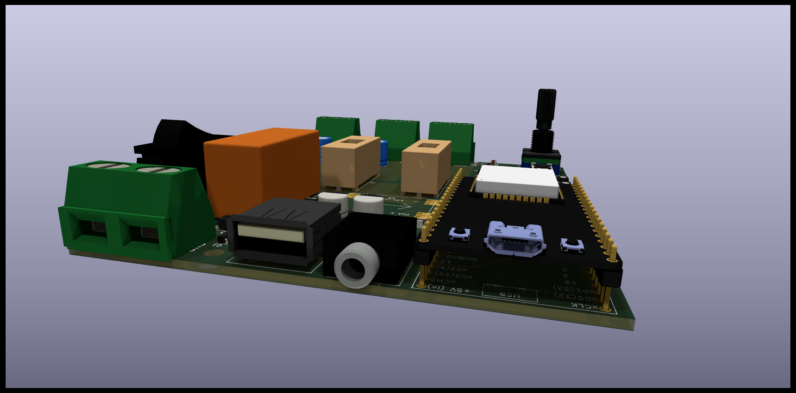

# ledStrip
Hobby project of (3-channel) addressable led-strips controller PCB and arduino code.

Features: 
  - power rating: 12V x 15A = 180 W combined (as designed, but depends on actual components you will use)
  - 3 channels (12V), each rated at 7A, having it's own fuse, 5V logic - tested on:
     - [WS2812B](https://www.amazon.com/stores/BTF-LIGHTING/page/0FF60378-45DE-44E7-B0D7-8F5CD6478971?ref_=ast_bln) strips.
     - [WS2815](https://www.amazon.com/stores/page/DC3DD961-F922-4197-AFD3-9C96122A1429?ingress=2&visitId=07e98571-6e49-4d4c-9a71-37c2eb7d5c01&ref_=ast_bln)
     - (but should work with any 12V power, 5V logic strips)
  - ESP32 (devkit C) powered, with Wifi support  - Web-Server control and remote firmware update 
  - [MSGEQ7](https://www.digikey.lu/htmldatasheets/production/2071107/0/0/1/MSGEQ7.pdf) spectrum analyzer connected to 3.5mm Audio Jack.
  - USB-A port (0.8A) to power the remote audio-player. 

## PCB

### Front

  
### Back

## Building with Arduino IDE:

Install in Arduine IDE board manager:
 -ESP32
 -ESP32 from expressif 

In Arduino IDE Library manager:
 - ESP32Encoder 0.10.2
  
## WARNING

THE SOFTWARE AND HARDWARE DESIGN IS PROVIDED “AS IS”, WITHOUT WARRANTY OF ANY KIND, EXPRESS OR IMPLIED, 
INCLUDING BUT NOT LIMITED TO THE WARRANTIES OF MERCHANTABILITY, 
FITNESS FOR A PARTICULAR PURPOSE AND NONINFRINGEMENT. 
IN NO EVENT SHALL THE AUTHORS OR COPYRIGHT HOLDERS BE LIABLE FOR ANY CLAIM, 
DAMAGES OR OTHER LIABILITY, WHETHER IN AN ACTION OF CONTRACT, TORT OR OTHERWISE, 
ARISING FROM, OUT OF OR IN CONNECTION WITH THE SOFTWARE OR THE USE OR OTHER DEALINGS IN THE SOFTWARE.

